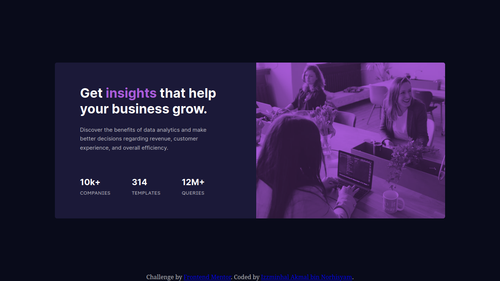

# Frontend Mentor - Stats preview card component solution

This is a solution to the [Stats preview card component challenge on Frontend Mentor](https://www.frontendmentor.io/challenges/stats-preview-card-component-8JqbgoU62). Frontend Mentor challenges help you improve your coding skills by building realistic projects. 

## Table of contents

- [Overview](#overview)
  - [The challenge](#the-challenge)
  - [Screenshot](#screenshot)
  - [Links](#links)
- [My process](#my-process)
  - [Built with](#built-with)
  - [What I learned](#what-i-learned)
  - [Continued development](#continued-development)
- [Author](#author)

## Overview

This is a Stats Preview Card solution.

### The challenge

Users should be able to:

- View the optimal layout depending on their device's screen size

### Screenshot



### Links

- Solution URL: [Github repo](https://github.com/Kemystra/frontendmentor-stats-preview-card)
- Live Site URL: [The site](https://delicate-tulumba-e0e889.netlify.app/)

### Built with

- Semantic HTML5 markup
- SCSS preprocesser
- Flexbox

### What I learned

A seemingly hacky solution that I came up with for making header texts responsive:
```css
#title {
  // This is a hack (well, a good one). 1.612 is the square root of 2.6
  // 2.6vw is the correct text size at dimension 1440x800
  // I think it helps the text to expand exponentially
  // See Inverse Square Law
  font-size: 1.612 * 1.612vw;
}
```

### Continued development

I really love `@mixin` in SCSS, and it's very useful when there's a lot of code. Definitely gonna find a new way to use it later.

## Author

- Frontend Mentor - [@Kemystra](https://www.frontendmentor.io/profile/Kemystra)
- Twitter - [@Kemystra](https://www.twitter.com/Kemystra)